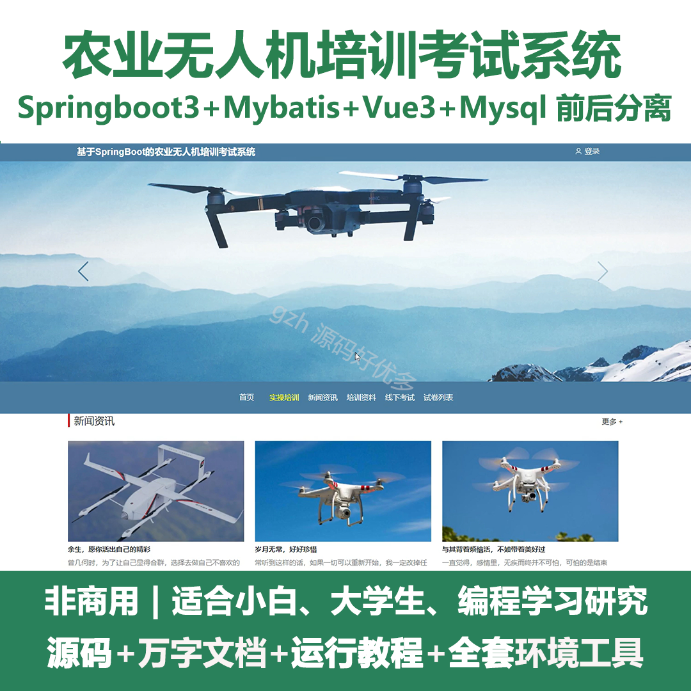
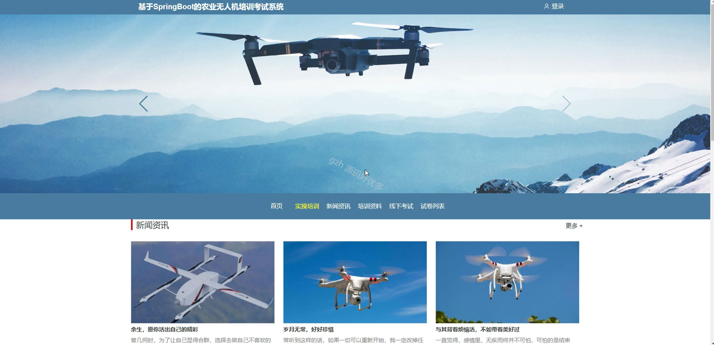
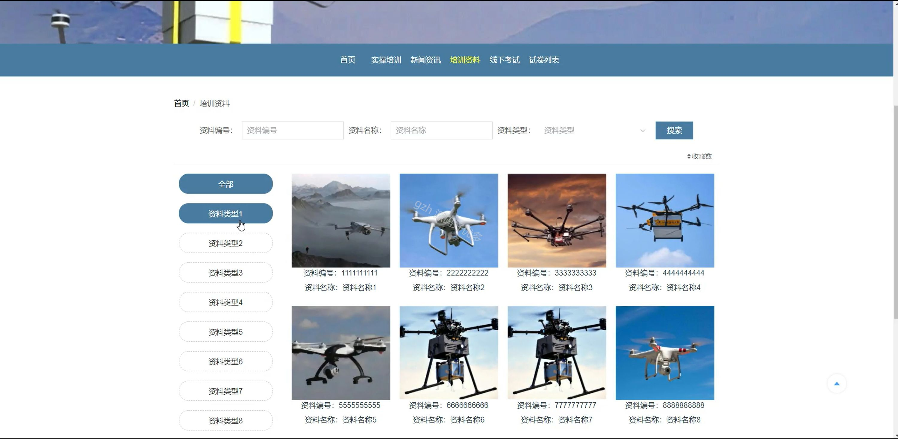
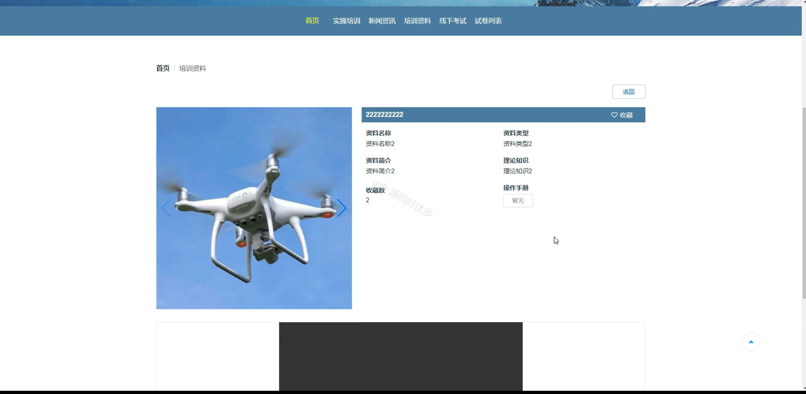
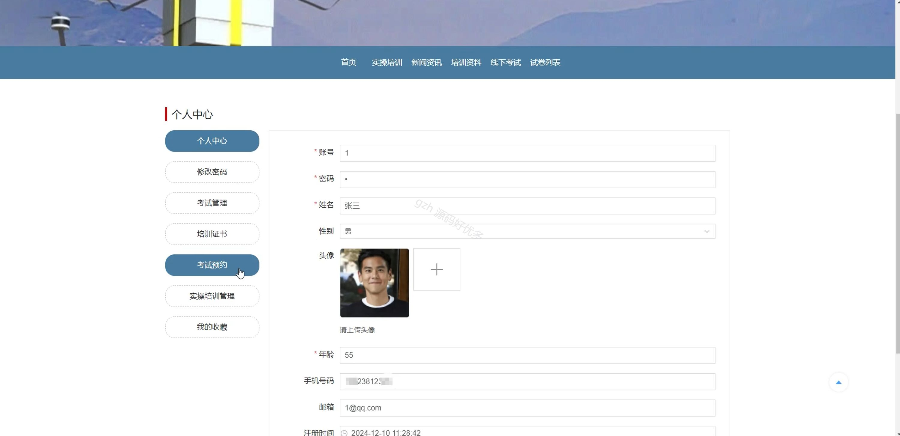
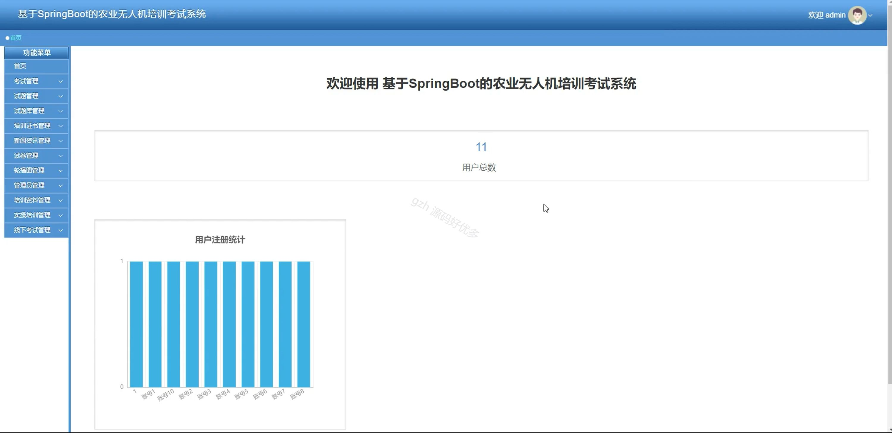
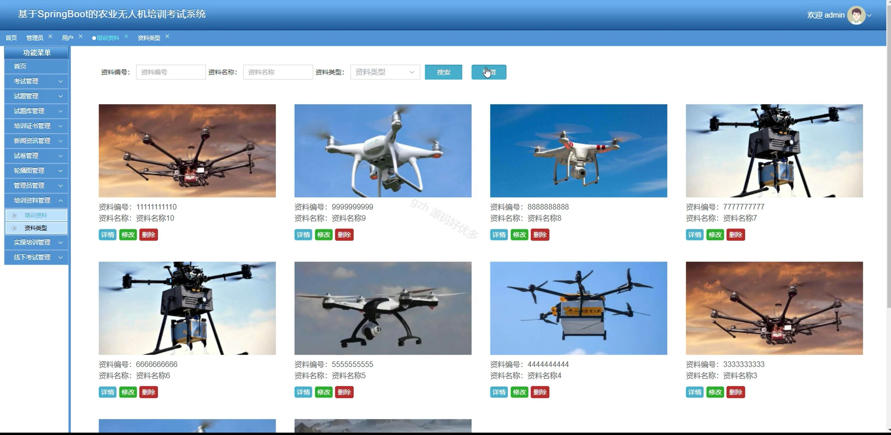
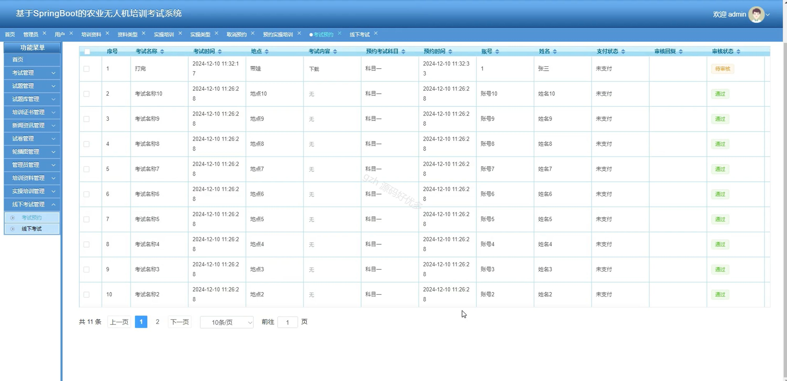
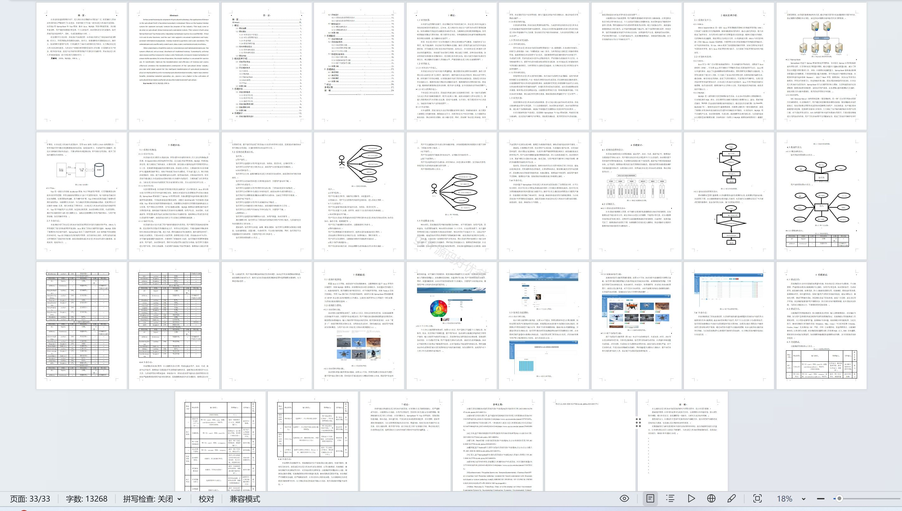

# springbootA243D
springbootA243D农业无人机培训考试系统+LW
 
## 查看主页获取源码

### 一、关键词
试题管理、培训证书管理、考试管理

### 二、作品包含
源码+数据库+设计文档万字+全套环境和工具资源+本地部署教程

### 三、项目技术
前端技术：Html、Css、Js、Vue3.0、Element-plus
后端技术：Java、SpringBoot3.0、MyBatis

### 四、运行环境（以下版本亲测，其他版本未知，请自测）
开发工具：IDEA/eclipse  + VSCODE

数据库：MySQL5.7（最低要5.7版本）

数据库管理工具：Navicat10以上版本

环境配置软件： JDK17 + Maven3.6.3

前端Nodejs：20

浏览器：谷歌浏览器

### 五、项目介绍
项目编号：springbootA243D

农业无人机培训考试系统可实现从培训学习到考试考核的全流程管理，助力用户提升农业无人机操作技能并获取相关资质。

角色：管理员、用户

管理员：首页、考试管理、试题管理、试题库管理、培训证书管理、新闻资讯管理、试卷管理、轮播图管理、管理员管理、培训资料管理、实操培训管理、线下考试管理。

用户：首页、实操培训、新闻资讯、培训资料、线下考试、试卷列表、个人中心、修改密码、考试管理、培训证书、考试预约、实操培训管理、我的收藏

### 六、运行截图

